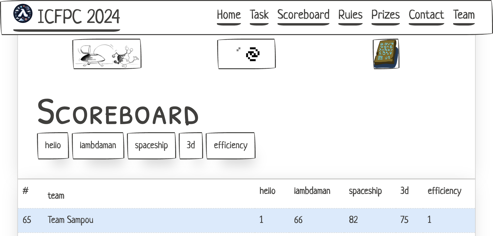

# ICFP Programming Contest 2024

This is Team Sampou's repository for the [ICFP Programming Contest 2024](https://icfpcontest2024.github.io/).

## Members

* [Katsutoshi Itoh](https://github.com/cutsea110)
* [Kei Hibino](https://github.com/khibino)
* [Masahiro Sakai](https://github.com/msakai)
* [Nobuo Yamashita](https://github.com/nobsun)

## Languages

* Haskell
* Python

## Tools

* [Z3](https://github.com/Z3Prover/z3)
* [GA-EAX-restart](https://github.com/senshineL/GA-EAX-restart)

## Usage

* Install [the Haskell Tool Stack](https://docs.haskellstack.org/en/stable/)
* Place your token (e.g. `????????-????-????-????-????????????`) in `token.txt`.
* `stack repl`  
  * Show scoreboard, etc.
    * `> cat "scoreboard"`
  * Submit solution
    * `> submitSolution "lambdaman1" "LLLDURRRUDRRURR"`
  * Simulate a 3D program.
    * `> ThreeD.readProblem "3d1/sol1.txt" >>= \prob -> ThreeD.runAndDrawWith' [('A', 2), ('B', 3)] prob`
* Replay lambda man solution:
  * `$ stack runhaskel -- scripts/lambdaman.hs 3 sol1.txt`
    * `3` is a problem number
    * `sol1.txt` is a solution file name under `solutions/lambdamanX/`
  * Press `ENTER` to step execution

## Solutions

Our solution files are available under [solutions/](solutions/).

## Other Resources

* [Japanese translation of task description](docs/task_ja.md)
